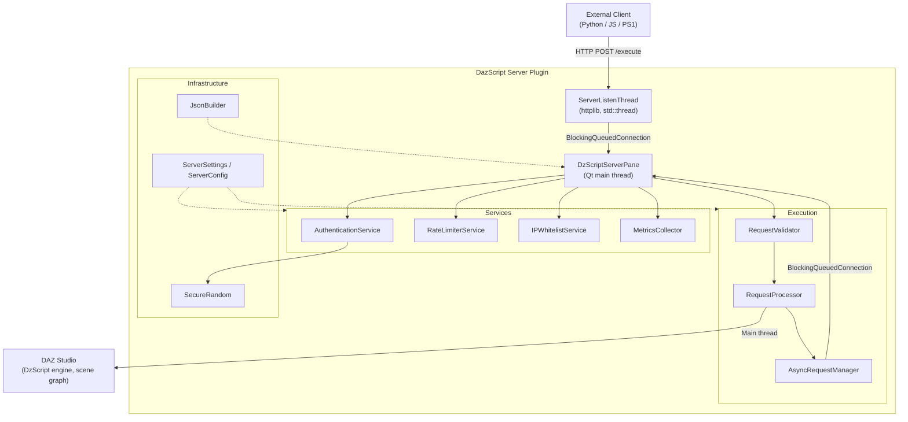
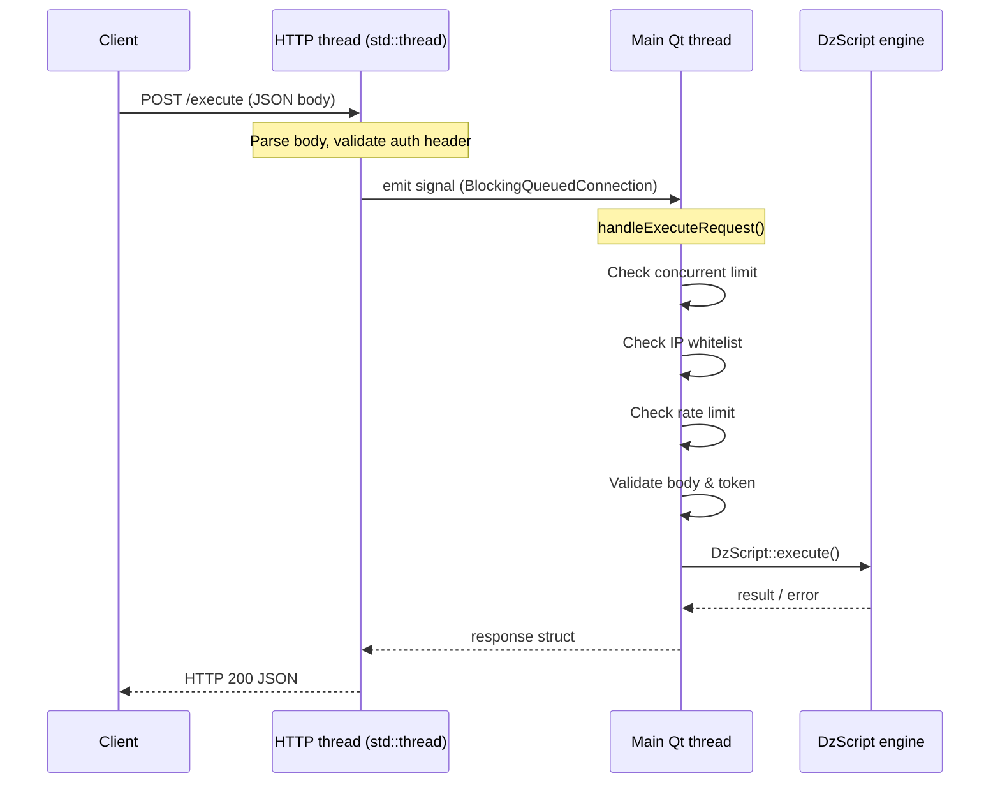
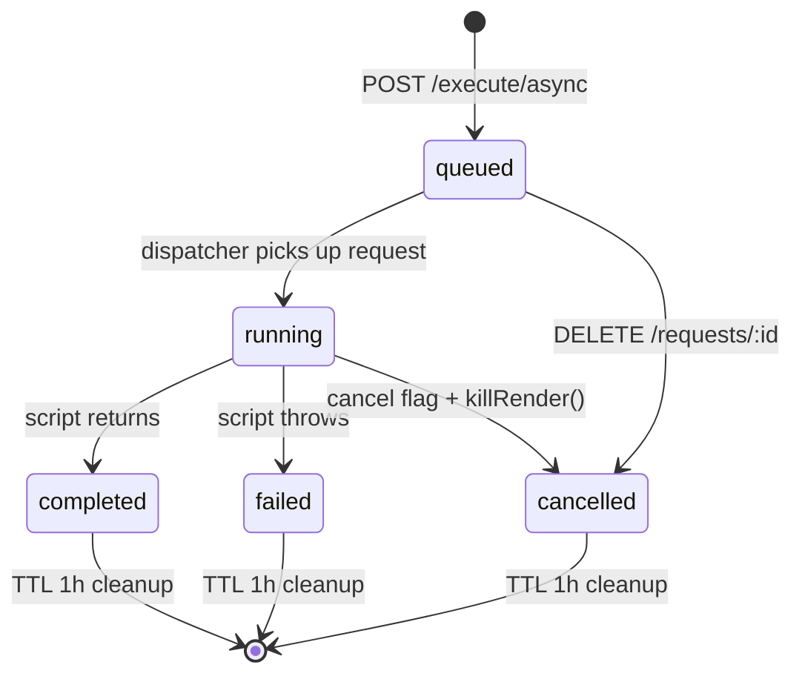
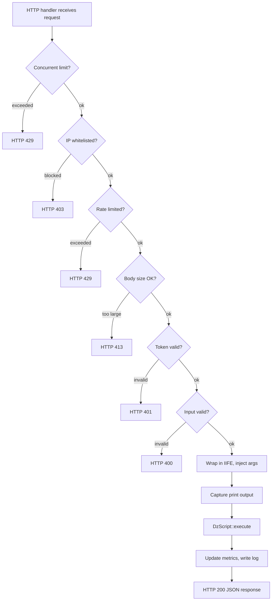

# DazScript Server — Architecture

## Overview

DazScript Server is a DAZ Studio pane plugin (`.dll` / `.dylib`) that embeds
an HTTP server inside the DAZ Studio process. External clients send DazScript
code over HTTP; the plugin executes it on DAZ Studio's main Qt thread and
returns a JSON response.

---

## Component Map



---

## Threading Model



**Rules that must never be broken:**

1. `DzScript`, `QScriptEngine`, and all DAZ API calls on the **main thread only**.
2. HTTP handlers (running on `std::thread`s) must emit signals with
   `Qt::BlockingQueuedConnection` to cross into the main thread.
3. `DzScript` objects must be created **and** destroyed on the main thread.
4. `killRender()` must be invoked via a signal on the main thread, not from
   the HTTP thread.

---

## Async Request Lifecycle



`AsyncRequestManager` owns the queue and the map of in-flight requests.
A cleanup timer fires every 5 minutes and purges entries older than 1 hour.

---

## Request Processing Pipeline



---

## Service Responsibilities

### AuthenticationService

- Generates 128-bit tokens via `SecureRandom` (CryptoAPI on Windows,
  `/dev/urandom` on Unix/macOS)
- Stores token to `~/.daz3d/dazscriptserver_token.txt` with `chmod 600`
- Validates `X-API-Token` and `Authorization: Bearer` headers
- Thread-safe: token loaded once at startup, read-only thereafter

### RateLimiterService

- Per-IP sliding-window counter (default: 60 req / 60 s)
- `QMutex`-protected map; stale entries cleaned up every 100 requests

### IPWhitelistService

- Exact-match list, comma-separated in settings
- `QMutex`-protected; applied after concurrent limit, before rate limit

### MetricsCollector

- Monotonic counters for total, successful, and failed requests, plus auth
  failures
- Persisted via QSettings across DAZ Studio restarts
- Provides uptime (seconds since server start) and calculated success rate

### AsyncRequestManager

- Thread-safe queue (`QMutex`) for incoming async work items
- Map of `request_id → AsyncRequest` for status and result retrieval
- TTL cleanup timer (Qt timer, fires on main thread)
- Long-poll support: waiting `GET /requests/:id/result?wait=true` calls block
  in `QWaitCondition` until the result is available or the timeout fires

---

## Data Flow: Script Arguments

```
Client JSON body
  └─ "args": { "key": "value" }
       │
       ▼
  QScriptEngine::evaluate("var __args = JSON.parse('" + escaped_args + "');")
       │
       ▼
  Script wrapping:
    (function(){
      // user script
    }).call(null, __args)
       │
       ▼
  Inside DazScript: getArguments()[0]  →  { key: "value" }
```

---

## Settings Storage

| Platform | Location |
|----------|----------|
| Windows  | `HKEY_CURRENT_USER\Software\DAZ 3D\DazScriptServer` |
| macOS    | `~/Library/Preferences/com.daz3d.DazScriptServer.plist` |
| Linux    | `~/.config/DAZ 3D/DazScriptServer.conf` |

All settings are accessed through `ServerSettings`, which wraps `QSettings`
and provides typed getters with range clamping from `ServerConfig` constants.

---

## Build System

```
CMakeLists.txt          — top-level: sets plugin type, platform flags
src/CMakeLists.txt      — source list, DAZ SDK include/link, MSVC /MD flag
include/common_version.h — DZSRV_VERSION_STR, bumped per release
```

Platform-specific notes:

- **Windows MSVC**: `/MD /U_DEBUG` — force multi-threaded DLL CRT, suppress
  DAZ SDK debug macros that conflict with Release builds
- **Windows link**: `ws2_32` (Winsock), `advapi32` (CryptoAPI)
- **macOS/Linux**: `SecureRandom` uses `/dev/urandom`; `chmod 600` via POSIX
  `chmod(2)`

---

## Key Design Decisions

### Why cpp-httplib instead of a Qt HTTP server?

Qt 4.8 (the SDK's Qt) has `QHttp` but it is deprecated and removed in later
Qt versions. `cpp-httplib` is header-only, zero-dependency, and well-maintained.
It runs on a dedicated thread managed by `ServerListenThread`.

### Why BlockingQueuedConnection for every request?

The DAZ Studio SDK explicitly requires all scene-graph and script-engine
operations on the main thread. `BlockingQueuedConnection` gives us the main-
thread guarantee while letting the HTTP thread block until the result is ready
(for synchronous `/execute`) or until the request is accepted into the queue
(for async endpoints).

### Why session-only script registry?

Persistent script storage would require a file-system schema and migration
logic. Session-only storage keeps the registry simple: clients re-register on
HTTP 404 (which happens after a DAZ Studio restart). The tradeoff is that
clients need a small registration step at startup.
